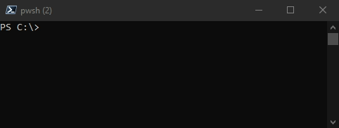
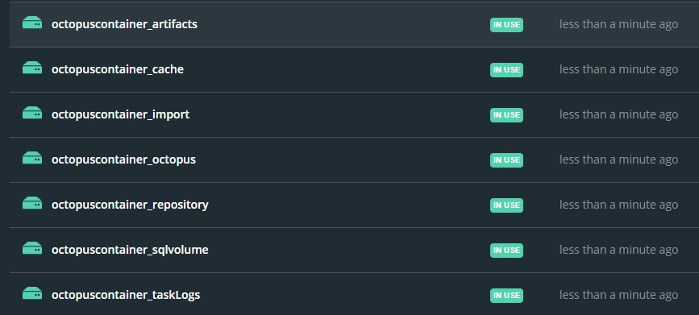

# Initial Setup - Docker-Compose
  Amend the [octopus.env](./octopus.env) file to use the below required variables:
  * `SA_PASSWORD` 
  * `SQL_IMAGE` = `mcr.microsoft.com/mssql/server:2019-latest` - recommended
  * `ADMIN_USERNAME`
  * `ADMIN_PASSWORD`
  * `ADMIN_EMAIL`
  * `MASTER_KEY`
  * `ADMIN_API_KEY` (there is a known issue related to this which you can check [here](https://github.com/OctopusDeploy/Issues/issues/6629))

  To speed up the process you can use the [`password generator`](../Automation/PasswordGen.ps1).
  You can run the script on your local machine

  

  #### Create project (composed container)
  ```powershell
  # Syntax: 
  docker-compose --project-name ${project_name} --env-file ${Path_To_Env_File.env} up -d
  # Example:
  docker-compose --project-name Octopus --env-file .\octopus.env up -d
  ```
# Steps to Commit and Save a Container to Image
 1. ## Backing up container to Docker Hub
    1. #### Create Image From Container
        ```powershell
        # Syntax: 
        docker $container_name "$backup_container_name`:$tag"
        # Example:
        docker commit octopus_db_1 octopus_db:18072021
        ```

    2. #### Push Image To Docker Hub. 
        `If Using MFA, Create An Access Token At [Docker Security Settings](https://hub.docker.com/settings/security)`
        ```powershell
        docker login -u username
        ```

    3. #### Create Tag For Image
        ```powershell
        # List images and IDs:
        docker images
        # Tagging Syntax: 
        docker tag $image_id "$your_docker_user`/$image_name`:$tag"
        # Example:
        docker tag 258a147eb1c2 gdhck/octopus_db:18072021
        ```

    4. #### Push Image To Docker Registry (Or Docker Hub)
        ```powershell
        # Syntax: 
        docker push "$your_docker_user`/$image_name`:$tag"
        # Example:
        docker push gdhck/octopus_db:18072021
        ```
    5. #### Remove Obsolete Images (i.e. backup just created)
        ```powershell
        # List images and IDs:
        docker images
        # Remove Image Syntax: 
        docker rmi $image_name_or_id
        # Example:
        docker rmi 258a147eb1c2
        ```
    6. #### Image Restore
        Amend the [octopus.env](./octopus.env) file to use the octopus_db image just pushed (i.e. `SQL_IMAGE = gdhck/octopusserver:latest`) and then run
        ```powershell
        # Create docker compose:
        docker-compose --project-name Octopus --env-file .\octopus.env up -d
        ```
2. ## Backing up image to File
    1. #### List Images
    ```powershell
    # Show a list of images and the IDs
    docker images
    ```
    2. #### Save Image
    ```powershell
    # Syntax: 
    docker save -o $zip_file_name.tar "$image_name_or_id`:$tag"
    # Remember to compress the below files using 7zip, the -o switch saved the output to a file
    # Example:
    docker save -o octopus_db.tar octopusdeploy/octopus_db:latest
    docker save -o octopus_web.tar octopusdeploy/octopus_web:latest
    ```
    3. #### Import Image
    ```powershell
    # Syntax: 
    docker load -i $path_to_tar_file
    # Example:
    docker load -i octopus_db.tar
    docker load -i octopus_web.tar
    ```

# Backup Volume's files -- Disaster Recovery
Volumes as such cannot be backed up. However, their files can be packaged externally in a **.tar** archive.

You can automate the below tasks by running the Powershell script [OctopusBackup.ps1](../Automation/Octopus%20Container%20Automation/OctopusBackup.ps1 "OctopusBackup.ps1") locally on the Docker server.
1. ## Backup DB Container volumes files
    1. #### Show a list of containers and the IDs
        ```powershell
        docker ps
        ```
    2. #### Export SQL container's data to an tarball archive file
        ```powershell
        # Remember to compress the files using 7zip
        # Syntax:
        docker run --rm --volumes-from $container_name -v "$Local_Backup_Folder`:$container_mounted_folder" ubuntu bash `
                    -c "cd $folder_to_backup && tar cvf `/$container_mounted_folder`/$archive_name.tar ."
        # Example:
        docker run --rm --volumes-from octopus_db_1 -v C:\Docker_Volumes_backups:/backup ubuntu bash `
                    -c "cd /var/opt/mssql/data && tar cvf /backup/octopus_dbs.tar ."
        ```
2. ## Backup Web Server Container's file system
    1. #### Show a list of containers and the IDs
        ```powershell
        docker ps
        ```
    2. #### Export container's data to an archive file
        ```powershell
        # Remember to compress the files using 7zip
        # Syntax:
        docker run --rm --volumes-from $container_name -v "$Local_Backup_Folder`:$container_mounted_folder" ubuntu bash `
                    -c "cd $folder_to_backup && tar cvf `/$container_mounted_folder`/$archive_name.tar ."
        # Example:
        # Backup of @(/repository, /artifacts, /taskLogs, /cache, /import, /Octopus)
        $directories = @("repository","artifacts","taskLogs","cache","import","Octopus")
        $octopusWebServer = "octopus_octopus-server_1"
        $backupdirectory = "C:\Docker_Volumes_backups"
        $mountpoint = $backupdirectory+":/backup"
        foreach ($directory in $directories){
                $command = "cd /"+$directory+" && tar cvf /backup/"+$directory+".tar ."
                docker run --rm --volumes-from $octopusWebServer -v $mountpoint ubuntu bash -c $command
            }
        ```

3. ## Restore The Docker Composed Container
    You can automate the below tasks by running the Powershell script [OctopusRestore.ps1](../Automation/Octopus%20Container%20Automation/OctopusRestore.ps1 "OctopusRestore.ps1") locally on the Docker server. I recommend specifying the variables' values within docker-compose.yml
    1. #### Create the composed container from scratch
        ```powershell
        # Syntax (--env-file): 
        docker-compose --project-name $project_name --env-file ${Path_To_Env_File.env} up -d
        # Syntax (without environment variables file): 
        docker-compose --project-name $project_name up -d
        # Example:
        docker-compose --project-name Octopus --env-file .\octopus.env up -d
        ```
    2. #### Overwrite the content of /var/opt/mssql with the one coming from the archive
        1. #### Stop the composed container
            ```powershell
            # Syntax: 
            docker-compose stop $project_name
            # Example (Run from within the directory where docker-compose.yml is stored. Variables defines within the docker-compose.yml):
            docker-compose stop $project_name
            ```
        2. #### Import database data back in the volumes
            ```powershell
            # Syntax: 
            docker run --rm --volumes-from $container_name -v "$Local_Backup_Folder`:$container_mounted_folder" ubuntu bash `
                        -c "rm -rf `/$folder_to_clear/* && cd $folder_to_clear && tar xvf `/$container_mounted_folder`/$archive_name.tar ."
            # Example:
            docker run --rm --volumes-from octopus_db_1 -v C:\Docker_Volumes_backups:/backup ubuntu bash `
                        -c "rm -rf /var/opt/mssql/data/* && cd /var/opt/mssql/data && tar xvf /backup/octopus_dbs.tar ."
            ```
        3. #### Import web file system's data back in the volumes
            ```powershell
            # Syntax: 
            docker run --rm --volumes-from $container_name -v "$Local_Backup_Folder`:$container_mounted_folder" ubuntu bash `
                        -c "rm -rf `/$folder_to_clear/* && cd $folder_to_clear && tar xvf `/$container_mounted_folder`/$archive_name.tar ."
            # Example:
            # Restore of @(/repository, /artifacts, /taskLogs, /cache, /import, /Octopus)
            $directories = @("repository","artifacts","taskLogs","cache","import","Octopus")
            $octopusWebServer = "octopus_octopus-server_1"
            $backupdirectory = "C:\Docker_Volumes_backups"
            $mountpoint = $backupdirectory+":/backup"
            foreach ($directory in $directories){
                    $command = "rm -rf /"+$directory+"/* && cd /"+$directory+" && tar xvf /backup/"+$directory+".tar ."
                    docker run --rm --volumes-from $octopusWebServer -v $mountpoint ubuntu bash -c $command
                }
            ```
        3. #### Start the composed container
             ```powershell
            # Syntax: 
            docker-compose start $project_name
            # Example (Run from within the directory where docker-compose.yml is stored. Variables defines within the docker-compose.yml):
            docker-compose start $project_name
            ```

# Troubloshooting
1. #### Check Container Resource Utilisation
    ```powershell
    docker stats
    ```
2. #### check if there are dangling volumes preventing Octopus from working properly
    ```powershell
    docker volume ls -f dangling=true
    ```
3. #### delete dangling volumes
    ```powershell
    docker volume rm $(docker volume ls -f dangling=true -q)
    ```
    #### Example of volumes created by Octopus
    

4. #### Start interactive shell with running container (works only with debian/linux/ubuntu based containers)
    #### Syntax: docker exec -it <container_id> /bin/bash
    ```powershell
    # Syntax:
    docker exec -it $container_id /bin/bash
    # Example:
    docker exec -it b4924f4768bd /bin/bash
    ```
# Perform Automated Tasks
Check out the task-automation scripts for containers within [Automation](../Automation)
