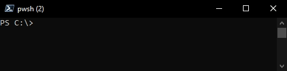
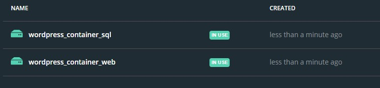

# Initial Setup - Docker-Compose
  Amend the [wordpress.env](./wordpress.env) file to use the below required variables:
  * `WORDPRESS_IMAGE_VERSION` 
  * `WORDPRESS_DB_USER`
  * `WORDPRESS_DB_PASSWORD`
  * `WORDPRESS_DB_NAME`
  * `MYSQL_IMAGE_VERSION` = `5.7` - reccomended

  To speed up the process you can use the [`password generator`](../Automation/PasswordGen.ps1).
  You can run the script on your local machine

  

  #### Create project (composed container)
  ```powershell
  # Syntax: 
  PS> docker-compose --project-name ${project_name} --env-file ${Path_To_Env_File.env} up -d
  # Example:
  PS> docker-compose --project-name Wordpress --env-file .\wordpress.env up -d
  ```
# Steps to Commit and Save a Container to Image
 1. ## Backing up container to Docker Hub
    1. #### Create Image From Container
        ```powershell
        # Syntax: 
        PS> docker $container_name "$backup_container_name:$tag"
        # Example:
        PS> docker commit wordpress_sql_1 wordpress_db:18072021
        ```

    2. #### Push Image To Docker Hub. 
        `If Using MFA, Create An Access Token At [Docker Security Settings](https://hub.docker.com/settings/security)`
        ```powershell
        PS> docker login -u username
        ```

    3. #### Create Tag For Image
        ```powershell
        # List images and IDs:
        PS> docker images
        # Tagging Syntax: 
        PS> docker tag $image_id "$your_docker_user/$image_name:$tag"
        # Example:
        PS> docker tag 258a147eb1c2 gdhck/wordpress_db:18072021
        ```

    4. #### Push Image To Docker Registry (Or Docker Hub)
        ```powershell
        # Syntax: 
        PS> docker push "$your_docker_user/$image_name:$tag"
        # Example:
        PS> docker push gdhck/wordpress_db:18072021
        ```
    5. #### Remove Obsolete Images (i.e. backup just created)
        ```powershell
        # List images and IDs:
        PS> docker images
        # Remove Image Syntax: 
        PS> docker rmi $image_name_or_id
        # Example:
        PS> docker rmi 258a147eb1c2
        ```
    6. #### Image Restore
        Amend the [wordpress.env](./wordpress.env) file to use the wordpress_db image just pushed (i.e. `MYSQL_IMAGE = gdhck/wordpress_db:18072021`) and then run
        ```powershell
        # Create docker compose:
        PS> docker-compose --project-name Wordpress --env-file .\wordpress.env up -d
        ```
2. ## Backing up image to File
    1. #### List Images
    ```powershell
    # Show a list of images and the IDs
    PS> docker images
    ```
    2. #### Save Image
    ```powershell
    # Syntax: 
    PS> docker save -o $zip_file_name.tar "$image_name_or_id:$tag"
    # Remember to compress the below files using 7zip, the -o switch saved the output to a file
    # Example:
    PS> docker save -o C:\test\wordpress_web.tar wordpress/wordpress_web:latest
    PS> docker save -o C:\test\wordpress_db.tar wordpress/wordpress_db:latest
    ```
    3. #### Import Image
    ```powershell
    # Syntax: 
    PS> docker load -i $path_to_tar_file
    # Example:
    PS> docker load -i C:\test\wordpress_db.tar
    PS> docker load -i C:\test\wordpress_web.tar
    ```

# Backup Volume's files -- Disaster Recovery
Volumes as such cannot be backed up. However, their files can be packaged externally in a **.tar** archive.

You can automate the below tasks by running the Powershell script [WordpressBackup.ps1](../Automation/Wordpress%20Container%20Automation/WordpressBackup.ps1 "WordpressBackup.ps1") locally on the Docker server.
1. ## Backup DB Container volumes files
    1. #### Show a list of containers and the IDs
        ```powershell
        PS> docker ps
        ```
    2. #### Export SQL container's data to an tarball archive file
        ```powershell
        # Remember to compress the files using 7zip
        # Syntax:
        PS> docker run --rm --volumes-from $container_name -v "$Local_Backup_Folder:$container_mounted_folder" ubuntu bash -c "cd $folder_to_backup && tar cvf /$container_mounted_folder/$archive_name.tar ."
        # Example:
        PS> docker run --rm --volumes-from wordpress_sql_1 -v C:\Docker_Volumes_backups:/backup ubuntu bash -c "cd /var/lib/mysql && tar cvf /backup/wordpress_dbs.tar ."
        ```
2. ## Backup Web Server Container's file system
    1. #### Show a list of containers and the IDs
        ```powershell
        PS> docker ps
        ```
    2. #### Export container's data to an archive file
        ```powershell
        # Remember to compress the files using 7zip
        # Syntax:
        PS> docker run --rm --volumes-from $container_name -v "$Local_Backup_Folder:$container_mounted_folder" ubuntu bash -c "cd $folder_to_backup && tar cvf /$container_mounted_folder/$archive_name.tar ."
        # Example:
        # Backup of @(/var/www/html)
        PS> docker run --rm --volumes-from wordpress_web_1 -v C:\Docker_Volumes_backups:/backup ubuntu bash -c "cd /var/www/html && tar cvf /backup/wordpress_web.tar ."
        ```

3. ## Restore The Docker Composed Container
    You can automate the below tasks by running the Powershell script [WordpressRestore.ps1](../Automation/Wordpress%20Container%20Automation/WordpressRestore.ps1 "WordpressRestore.ps1") locally on the Docker server.
    1. #### Create the composed container from scratch
        ```powershell
        # Syntax: 
        PS> docker-compose --project-name $project_name --env-file ${Path_To_Env_File.env} up -d
        # Example:
        PS> docker-compose --project-name Wordpress --env-file .\wordpress.env up -d
        ```
    2. #### Overwrite the content of /var/opt/mssql with the one coming from the archive
        1. #### Stop the composed container
        2. #### Import database data back in the volumes
            ```powershell
            # Syntax: 
            PS> docker run --rm --volumes-from $container_name -v "$Local_Backup_Folder:$container_mounted_folder" ubuntu bash -c "rm -rf /$folder_to_clear/* && cd $folder_to_clear && tar xvf /$container_mounted_folder/$archive_name.tar ."
            # Example:
            PS> docker run --rm --volumes-from wordpress_sql_1 -v C:\Docker_Volumes_backups:/backup ubuntu bash -c "rm -rf /var/lib/mysql* && cd /var/lib/mysql && tar xvf /backup/wordpress_dbs.tar ."
            ```
        3. #### Import web file system's data back in the volumes
            ```powershell
            # Syntax: 
            PS> docker run --rm --volumes-from $container_name -v "$Local_Backup_Folder:$container_mounted_folder" ubuntu bash -c "rm -rf /$folder_to_clear/* && cd $folder_to_clear && tar xvf /$container_mounted_folder/$archive_name.tar ."
            # Example:
            # Restore of @(/repository, /artifacts, /taskLogs, /cache, /import, /Octopus)
            PS> docker run --rm --volumes-from wordpress_web_1 -v C:\Docker_Volumes_backups:/backup ubuntu bash -c "rm -rf /var/www/html* && cd /var/www/html && tar xvf /backup/wordpress_web.tar ."
            ```
        3. #### Start the composed container
             * Start SQL container
             * Start WEB container

# Troubloshooting
1. #### Check Container Resource Utilisation
    ```powershell
    PS> docker stats
    ```
2. #### check if there are dangling volumes preventing Octopus from working properly
    ```powershell
    PS> docker volume ls -f dangling=true
    ```
3. #### delete dangling volumes
    ```powershell
    PS> docker volume rm $(docker volume ls -f dangling=true -q)
    ```
    #### Example of volumes created by Octopus
    

4. #### Start interactive shell with running container (works only with debian/linux/ubuntu based containers)
    #### Syntax: docker exec -it <container_id> /bin/bash
    ```powershell
    # Syntax:
    PS> docker exec -it $container_id /bin/bash
    # Example:
    PS> docker exec -it b4924f4768bd /bin/bash
    ```
# Perform Automated Tasks
Check out the task-automation scripts for containers within [Automation](../Automation)
